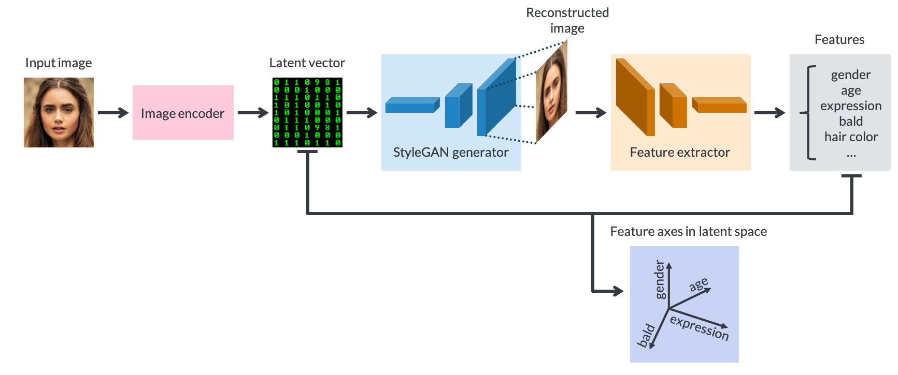

## Portrait-GANerator -- Deep Learning for Portrait Editing

This repository is for my 4-week project at [Insight Data Science](https://www.insightdatascience.com).

Portrait-GANerator is a portrait editing pipline that built based on a StyleGAN encoder ([@pbaylies](https://github.com/pbaylies/stylegan-encoder)) and latent space manipulation ([@SummitKwan](https://github.com/SummitKwan/transparent_latent_gan)).

* A Google Slides presenting the main ideas of this project is available [at this link](https://docs.google.com/presentation/d/1A2kYn3ROiRvGmY4l9Wl4ahF8fPFGcvkpsWgNYpymV4Y/edit#slide=id.g649c22c645_1_444).
* A blog post expaining more details about the motivation, analysis, and results will be posted soon.

<!-- An GUI demo will be demonstrated [at this link]() in Kaggle. -->  





<!-- All the following in root directory -->

<!-- Tested on Nvidia K80 GPU with CUDA 9.0, with Anaconda Python 3.6
p2.xlarge: Ubuntu 16.04+k 80 GPU
NVIDIA K80 GPU -->


### Set up the code and environment
* Tested on Nvidia K80 GPU, with Anaconda Python 3.6

* Clone this repository by running `git clone https://github.com/FangfeiLi05/Insight_Project.git` in terminal.

* `cd` to the root directory of the project (the folder containing README.md)

* Install dependencies by running `pip install -r requirements.txt` in terminal.


### Encode image into latent vector (code from [@pbaylies](https://github.com/pbaylies/stylegan-encoder))
* Train a ResNet with `train_resnet.py`, or a EfficientNet with `train_effnet.py`. This trained model will convert a image to a latent vector (18*512), which is used as the initial value in latent vector optimization in StyGAN encoder. You can also download a pre-trained ResNet [finetuned_resnet.h5](https://drive.google.com/open?id=12nM4KU7IBXGV5b5j1QV9f_3XQ2WmI8El) or a pre-trained EfficientNet [finetuned_effnet.h5](https://drive.google.com/open?id=12zWrGc3W0YuPANn3Rnl3OrNPskBO69fz), and put them in the folder `~/data/`.
  ```
  #python train_resnet.py --help
  #python train_effnet.py --help
      
  python train_resnet.py --test_size 256 --batch_size 1024 --loop 1 --max_patience 1
  python train_effnet.py --test_size 256 --batch_size 1024 --loop 1 --max_patience 1
  ``` 


* Align (center and crop) images with `align_images.py`. The aligned images are stored in the folder `~/images_aligned/`
  ```
  python align_images.py images_raw/ images_aligned/
  ```


* Convert each image in the folder `~/images_aligned/` into a latent vector with `encode_images.py`. The lantent representations are stored in the folder `~/images_latent/`. The reconstructed images are also outputted to a folder `~/images_reconstructed/`.
  ```
  python encode_images.py --batch_size=1 --output_video=True --load_effnet=data/finetuned_effnet --use_vgg_loss=1 images_aligned/ images_generate/ images_latent/
  ```


### Identify feature axis in latent space

* Train a generalized linear model to get 16 normalized and orthogonal feature axes (`Gender, Makeup, Glasses, Age, Smile, Anger, Contempt, Disgust, Fear, Neutral, Sadness, Surprise, Beard, Bald, BlondHair, BlackHair`) in the latent space, with `feature_axis.py`. You can also download pre-trained feature axes [feature_axis.h5](https://drive.google.com/open?id=1TFHtjZTpZqcZLt8Ovx54XeoT-wHZXkgc), and put them in the folder `~/data/`.
<!-- A latent training dataset is [at this link](https://drive.google.com/uc?id=1xMM3AFq0r014IIhBLiMCjKJJvbhLUQ9t). -->
  ```  
  python feature_axis.py
  ```


* Tune each feature in the latent space and reconstruct the image.
  ```
  import pandas as pd
  import numpy as np
  from PIL import Image
  from manipulate_latent import latent_to_imageRGB, latent_to_image, tune_latent
  
  display(Image.open('./images_raw/000001.jpg'))   # Original image
  
  display(Image.open('./images_aligned/000001_01.png').resize((256,256)))   # Aligned image
  
  image_array = latent_to_imageRGB(image_latent)
  Image.fromarray(image_array, 'RGB').resize((256,256), PIL.Image.LANCZOS)
  image_latent = np.load('./images_latent/000001_01.npy')
  latent_to_image(image_latent)   # Reconstructed photo

  feature_axis_DataFrame = pd.read_hdf('./data/feature_axis.h5', 'df')
  feature_axis_array = np.array(feature_axis_DataFrame)
  i = 15
  direction = feature_axis_array[:,i].reshape((18, 512))
  coeff = 10
  image_latent_tuned = tune_latent(image_latent, direction, coeff, list(range(8)))
  latent_to_image(image_latent_tuned)   # Feature-tuned photo
  ```


### Results demonstration


