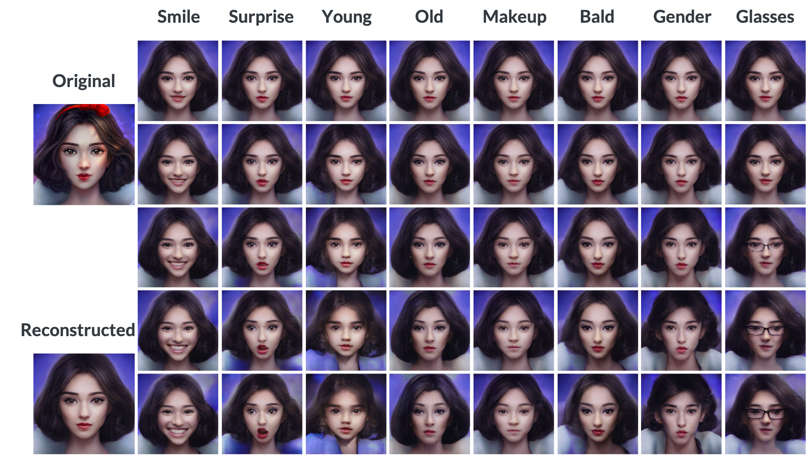

[](https://www.python.org/)
[](https://lbesson.mit-license.org)
[](https://aws.amazon.com/)
[](https://colab.research.google.com/notebooks/welcome.ipynb)
[]()


## Portrait-GANerator: Deep Learning for Portrait Editing

This repository is for my 3-week project at [Insight Data Science](https://www.insightdatascience.com): **Portrait-GANerator: Deep Learning for Portrait Editing**. 

### Introduction
*Portrait-GANerator* is a pipline for portrait editing, which is capable of continuously tune sixteen facial features (*Gender, Makeup, Glasses, Age, Smile, Anger, Contempt, Disgust, Fear, Neutral, Sadness, Surprise, FacialHair, Hair, BlondHair, BlackHair*). Portrait-GANerator is built based on a image encoder ([@pbaylies](https://github.com/pbaylies/stylegan-encoder)) and the latent space manipulation ([@SummitKwan](https://github.com/SummitKwan/transparent_latent_gan)). The image encoder converts a image into a latent representation *w* (18x512 matrix). Basically, *w* is initialized by a pre-trained ResNet. Then *w* is input into a pre-trained StyleGAN generator to output a image. The perceptual loss, which is defined as the difference of the 9-th layer's activation of a pre-trained VGG16 between the original image and the reconstructed image，is calculated. *w* is optimized by minimizing the perceptual loss. This image encoding process takes about 2 minutes per image by running on a single GPU. Before performing the latent space manipulation for the obtained *w*, we need to identify all sixteen feature axes in the latent space. The [dataset](https://drive.google.com/uc?id=1xMM3AFq0r014IIhBLiMCjKJJvbhLUQ9t) (from [@pbaylies](https://github.com/pbaylies/stylegan-encoder)) used for training the feature axes constits of 20,307 synthetic portrait images, with more than 30 features included. Here I take sixteen features. A multivariate multidependents logistic regression model is applied to simultaneously obtain all feature directions in the latent space. It takes about 5 minutes to train the model in a single GPU. Gram–Schmidt technique is then used turning these feature directions into feature axes (normalized and orthogonal). With *w* and feature axes available, we can tune particular features by moving *w* along corresponding feature axes. We input the tuned *w* to the pre-trained StyleGAN generator, thus obtaining the portrait with custom features. Here, the tuning of the facial features is continous, because the moving of *w* in the latent space is continous. The figure below shows the whole pipline described above.


There are many existing apps for facial features tuning. However, most of them can only tune a single feature and the tuning is binary. Portrait-GANerator can continuously tune multiple facial features. In addition, Portrait-GANerator includes one more function, predict the kid's face with gender of two people given their portaits.


<!-- 
Generative adversarial networks (GANs) are a class of neural network architecture introduced by Ian J. Goodfellow in 2014 ([[1](https://papers.nips.cc/paper/5423-generative-adversarial-nets.pdf)]). Given a training set, GAN learns to generate new data with the same statistics as the training set. GAN consists of two neural netowrks, the generator and the discriminator. The generator generates fake samples of data (such as image, audio, etc.) to fool the discriminator, while the discriminator tries to identify fake samples from real ones. The two parts compete with each other during the training, until both get better and better in their respective jobs. GAN is originally proposed for unsupervised learning, and has also been successfully applied to semi-supervised and supervised learning.
In 2017, Tero Karras proposed [Progressive Growing GAN (PGGAN)](https://github.com/tkarras/progressive_growing_of_gans) ([[2](https://arxiv.org/abs/1710.10196)]). PGGAN is trained to generate high-resolution (1024×1024) photorealistic synthetic faces by incrementally adding layers to both generator and discriminator to allow larger output size of generator and larger input size of discriminator. Each synthetic face carries random facial features (such as smiling, age, etc.). In 2018, Insight Data Science AI fellow Shaobo Guan ([@SummitKwan](https://github.com/SummitKwan/transparent_latent_gan)) developed [Transparent Latent-GAN (TL-GAN)](https://blog.insightdatascience.com/@summitkwan), which can generate synthetic faces with custom facial features by combining the latent space manipulation with the PGGAN generator. Latent space is the vector space within which are latent vectors. The word *latent* means *hidden*. Latent vectors are inferred (not directly observed) vectors transformed from the data. Latent space captures the structure of the data, by a feature that latent vectors of the similar data are closer in the latent space. In specific, TL-GAN identifies the feature axes in the latent space, then moves the latent vector （512x1 vector） along specific feature axes, and inputs the tuned latent vector to PGGAN generator to generate random images with those features. <!-- In 2019, Tero Karras proposed [StyleGAN](https://github.com/NVlabs/stylegan) ([[3]](https://arxiv.org/abs/1812.04948)). (2 sentences introduce StyleGAN) 
Inspired by these works that focus on generating synthetic faces, I devoloped a pipline for portait editing, *Portrait-GANerator*, which is capable of continuously tune sixteen facial features (*Gender, Makeup, Glasses, Age, Smile, Anger, Contempt, Disgust, Fear, Neutral, Sadness, Surprise, Beard, Bald, BlondHair, BlackHair*). Portrait-GANerator is built based on a image encoder ([@pbaylies](https://github.com/pbaylies/stylegan-encoder)) and the latent space manipulation. The image encoder converts a image into a latent representation *w* (18x512 matrix). Basically, *w* is initialized by a pre-trained ResNet. Then *w* is input into a pre-trained StyleGAN generator to output a image. The perceptual loss, which is defined as the difference of the 9-th layer's activation of a pre-trained VGG16 between the original image and the reconstructed image，is calculated. *w* is optimized by minimizing the perceptual loss. This image encoding process takes about 2 minutes per image by running on a single GPU. Before performing the latent space manipulation for the obtained *w*, we need to identify all sixteen feature axes in the latent space. The dataset ([add here]) used for training the feature axes constits of 20,307 portrait images, with --- features in total. Here I take sixteen features. A multivariate multidependents logistic regression model is applied to simultaneously obtain all feature directions in the latent space. It takes about 5 minutes to train the model in a single GPU. Gram–Schmidt technique is then used turning these feature directions into feature axes (normalized and orthogonal). With *w* and feature axes available, we can tune particular features by moving *w* along corresponding feature axes. We input the tuned *w* to the pre-trained StyleGAN generator, thus obtaining the portrait with custom features. Here, the tuning of the facial features is continous, because the moving of *w* in the latent space is continous. Figure 1 shows the whole pipline described above.

There are many existing apps for facial features tuning. However, most of them can only tune a single feature and the tuning is binary. Portrait-GANerator can continuously tune multiple facial features. In addition, Portrait-GANerator includes one more function, predict the kid's face with gender of two people given their portaits. 
Figure 2 is an example demonstrating the performance of Portrait-GANerator. The row corresponds to facial feature, and the column show the degree of the tuning. Figure 3 shows the process of optimizing perceptual loss. Figure 4 is an example of predicting the kid's face. A detailed walk-through of the whole pipeline is available at my Github [https://github.com/FangfeiLi05/Insight_Project]. Code for n GUI demo is also attached.
Potential future direction: try different loss function, try on animals, animations, art pictures...
-->


### Resources
* A Google Slides presenting the main ideas of this project is available [here](https://docs.google.com/presentation/d/1A2kYn3ROiRvGmY4l9Wl4ahF8fPFGcvkpsWgNYpymV4Y/edit#slide=id.g649c22c645_1_444).
* A blog post expaining more details about the motivation, analysis, and results will be posted soon.
* An GUI demo will be demonstrated in Kaggle soon.


<!-- All the following in root directory -->


### Pipeline Tutorial

#### 1. Set up coding environment
* GPU is required, with Anaconda Python 3.6. This pipeline has been tested on AWS (Amazon Web Services) with a Amazon EC2 P2 instance *p2.xlarge* (single NVIDIA K80 GPU) in AMI (Amazon Machine Images) *Deep Learning AMI (Ubuntu 16.04) Version 25.3*. In addition, this pipeline has also been tested on Google Colab with free GPU. A walk-through Colaboratory is available [](https://drive.google.com/file/d/1M9uELf-TEY2nflf8GXVhUsM5q-pUZZiB/view?usp=sharing).

* Clone this repository by running `git clone https://github.com/FangfeiLi05/Insight_Project.git` in terminal.

* `cd` to the root directory of the project (the folder containing `README.md`).

* Install dependencies by running `pip install -r requirements.txt` in terminal.


#### 2. Identify feature axes
* Train a multivariate multidependents logistic regression model to simultaneously get all normalized and orthogonal feature axes in the latent space, with `feature_axis.py`. 
  ```  
  python feature_axis.py
  ```
The output file `feature_axis.h5` is saved in the folder `~/data/`. To skip this training, you can also download a pre-trained feature axes file [feature_axis.h5](https://drive.google.com/open?id=1yRpdWXKnUYSjtye4QXzJ3FxMx3QxuOq2), make a folder by `mkdir data` and put the downloaded file into the folder `~/data/`.
  


#### 3. Train a EfficientNet or a ResNet
* Train a EfficientNet with `train_effnet.py`. 
  ```
  python train_effnet.py --test_size 256 --batch_size 1024 --loop 1 --max_patience 1
  ``` 
The output file `finetuned_effnet.h5` is saved in the folder `~/data/`. This trained EfficientNet can convert a image to a latent vector (18*512), that is used as the initial value in encoding the image to a latent vector. You can also download a pre-trained EfficientNet [finetuned_effnet.h5](https://drive.google.com/open?id=1a_YAtOxent3sHT3l2dakSQT_YC2nbboz), and put the downloaded file into the folder `~/data/`.

* Train a ResNet with `train_resnet.py`. 
  ```
  python train_resnet.py --test_size 256 --batch_size 1024 --max_patience 1
  ``` 
The output file `finetuned_resnet.h5` is saved in the folder `~/data/`. This trained EfficientNet can convert a image to a latent vector (18*512), that is used as the initial value in encoding the image to a latent vector. You can also download a pre-trained EfficientNet [finetuned_resnet.h5](https://drive.google.com/open?id=1wikytOx3ldfFqrEKq1tAyVI70iSBB_Nb), and put the downloaded file into the folder `~/data/`.


#### 4. Encode image into latent vector
* Encode the image into the latent vector with `image_encoder.py`. 
  ```
  python image_encoder.py --load_effnet=data/finetuned_effnet --use_vgg_loss=1 images_raw/ images_aligned/ images_generate/ images_latent/
  ```
The input original images are stored in the folder `~/images_raw/`. The output aligned images are stored in the folder `~/images_aligned/`. The output reconstructed images are stored in the folder `~/images_generate/`. The output latent vectors of images are stored in the folder `~/images_latent/`.


#### 5. Tune facial features
* Tune facial features by moving the latent vector in the latent space, then reconstruct the image using the pretrained StyleGAN generator.
  ```
  from PIL import Image
  import numpy as np
  from manipulate_latent import latent_to_image
  
  print('Original photo...')
  display(Image.open('./images_raw/000001.jpg'))
  
  print('Aligned photo...')
  display(Image.open('./images_aligned/000001_01.png').resize((256,256)))

  print('Reconstructed photo...')
  image_latent = np.load('./images_latent/000001_01.npy')
  latent_to_image(image_latent)


  import pandas as pd
  from manipulate_latent import tune_latent

  feature_axis_DataFrame = pd.read_hdf('./data/feature_axis.h5', 'df')
  feature_axis_array = np.array(feature_axis_DataFrame)
  i = 3
  direction = feature_axis_array[:,i].reshape((18, 512))
  coeff = 10

  print('Feature-tuned photo...')
  image_latent_tuned = tune_latent(image_latent, direction, coeff, list(range(8)))
  latent_to_image(image_latent_tuned)
  ```


### Results

The three figures below show the performance of Portrait-GANerator. The row corresponds to facial feature, and the column show the degree of the tuning.





The figure below shows the process of optimizing perceptual loss. 


Code for n GUI demo is also attached.

Potential future direction: try different loss function, try on animals, animations, art pictures...

